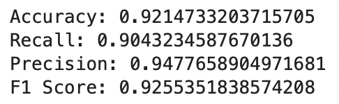

# GA Project 3: Classification of Subreddits
This project is a classification machine learning model with a single goal - to be able to distinguish and accurately identify which subreddit each of the entries come from. The workflow is loosely as follows:

1. **[Webscraping](P3-1_WebScrape.ipynb)** using the [pushshift api](https://github.com/pushshift/api) to obtain the necessary submissions from each subreddit;
2. Performing **[preprocessing and EDA](P3-2_PP_EDA.ipynb)** on the data obtained, and;
3. Evaluating a plethora of **relevant [models](P3-3_Model_Consolidated.ipynb)** with **hyperparameter tuning** to figure out which is the best predictive model for this job, and evaluate its results.

## 0 Background of Scenario
*"For roughly 98 percent of the last 2,500 years of Western intellectual history, **philosophy was considered the mother of all knowledge**. It generated most of the fields of research still with us today. This is why we continue to call our highest degrees Ph.D.’s, namely, philosophy doctorates. At the same time, we live an age in which many seem no longer sure what philosophy is or is good for anymore. Most seem to see it as a highly abstracted discipline with little if any bearing on objective reality — something more akin to art, literature or religion. All have plenty to say about reality. But the overarching assumption is that none of it actually qualifies as knowledge until proven scientifically."*

This is the introduction from a [2012 nytimes opinion post](https://archive.nytimes.com/opinionator.blogs.nytimes.com/2012/04/05/philosophy-is-not-a-science/) about Philosophy, and how it has gone from being mankind's source of knowledge and wisdom to being relegated to the realm of arts. In its place, 'Science' has become our society's fundamental source of objective truth, trusting more in scientific methods than the lofty abstractions philosophers offer. 

One observation you may have, however, is that the language used in these two fields often share some commonality. Both are still treated as formal disciplines, complete with their own insular communities of scholars, debating using evidence-based and research-backed arguments. The common man would such naturally have trouble distinguishing between the two, and may struggle to separate scientific fact from philosophical reasoning, if only given the text.

The moderators of r/science and r/philosophy have caught on to this issue, and teamed up to try and solve the problem using **machine learning** to tell difference between the rhetorics. 

Armed with an army of data from each subreddit, they hope to create a tool that can help their redditers to figure out (*with reasonable accuracy*) **whether their articles/posts/thoughts are better suited for scientific discussion or philosophical debate, and more importantly which subreddit it should go into**.

## 1 Data Extraction - Scraping from Subreddits
The [Webscraping](P3-1_WebScrape.ipynb) notebook aims to document and run the webscraping algorithm used to generate the submission data from r/science and r/philosophy, utilising the [pushshift api](https://github.com/pushshift/api). This is done with the following considerations:

1. Importing 25,000 submissions (posts) from each subreddit;
2. Webscraping about 200 submissions each time, with a 3-5 second time delay;
3. Compile the submissions into a single dataframe with the outputs 'subreddit', 'title', 'selftext', 'url', and 'author'. Note that for the purposes of this analysis, only the title and selftext are considered for data, and the subreddit as the target vector;
4. Standardise post scraping to before Monday, 3 October 2022 16:00:00 GMT (*Epoch Time: 1664812800*), so that the data is consistent each time the scraping function is run.

For generalisation, the function was defined with variable inputs, in case there is a need to rerun again with different inputs or targets.

## 2 Pre-Processing of Data and EDA
The [preprocessing and EDA](P3-2_PP_EDA.ipynb) aims to document both the **pre-processing** steps taken to sift through and clean data, as well as the **exploratory data analysis** (EDA) on the data itself.

For the EDA portion, we will looking mainly at n-grams and text length to gain some insights into the strength and efficacy of the data obtained, and what we believe to be able to use such data for.

### 2.1 Pre-Processing and Data Cleaning
The pre-processing cleaning steps can be summarised as follows:
1.  Remove empty fields in selftext
2.  Combine title and selftext into single string vector
3.  Lowercase text
4.  Remove Emojis
5.  Remove urls
6.  Tokenise text by words
7.  Remove stopwords
8.  Remove Special Characters  
9.  Remove blanks
10. lemmatise tokens (*Due to time constraints, stemmatised tokens will not be explored*)

#### 2.1.1 Most Used Words

**Observations:**  
*Science:*
1. The science posts seem to have decent identifiers, based on the top 20 words.
2. Considerations for 'noise' in science: 'covid19'. Upon further investigation, the covid19-related submissions cannot be considered noise, since most (if not all) are related to actual pandemic reports.

*Philosophy:*
1. Seems to be quite a number of 'spam' entries that need to be investigated, namely 'crack', 'update', 'verdictnirvanacom', 'download'.
2. Lower frequency in highest used words suggest a more diverse pool of vocabulary in the philosophy subreddit than the science one.

### 2.2 N-Grams
 
 

From both the bigram and trigram analysis, we notice a few notable points of observation. 

The science bi and trigrams are consistent with the unigrams; they are largely reflective of expected scientific speech rhetoric, and give us confidence in the text as an objective vector for subreddit prediction.  

In contrast, the r/philosophy n-grams, much like the unigrams, reflects alot of clutter and spam, some of which was not removed in this EDA's pre-processing stage. This is a consideration for future improvement of the model; that is, to look into cleaning out the remaining spam posts from the philosophy subreddit, and see whether cleaner datasets would allow us better, more accurate predictions.

### 2.3 Text Length

In general, we can see that the text length for posts in the science subreddit are longer than those in the philosophy subreddit. Both distributions are quite left-skewed, with the median closer to the left than the right. This is especially true for r/philosophy, where the the 25th to 75th percentiles are scrunched close together around 50 words per submission.

The spread of text lengths for submissions varies alot more for r/science posts than r/philosophy. This gives us some confidence that text-based vectors would be good descriptors for predicting which subreddit the information may come from (*median ~100 words for science, and ~50 for philosophy*).

## 3 Modelling
In the [Modelling](P3-3_Model_Consolidated.ipynb) notebook, we take the formatted data from our [EDA Notebook](P3-2_PP_EDA.ipynb) and feed the results into a number of various vectorizer/model pairs. [MLFlow](P3_Run_mlops.ipynb) was used to track the performance of the models. The packages used (from sklearn) are as follows:

**Vectorizers:**
1. Count Vectorization
2. TF-IDF Vectorization

**Classifier Models:**
1. Naive Bayes
2. Logistic Regression
3. Random Forest
4. Extra Trees

Each combination is run for a total of 8 models evaluated. Some level of hyperparameter tuning will be run, trying to balance iterating through a robust set of variables while maintaining reasonable computational time. A brief summary of which parameters are chosen for hyperparameter tuning are as follows:

Note: This is the second, more streamlined iteration of hyperparameter tuning, and some hyperparameters were removed in the interest of time (*evaluated in a [previous version](P3-3_Model_Basic.ipynb)*). The parameters that were identified to always be ignored as best_parameters across most (*if not all*) models were removed from the final model evaluation.

**Vectorizers:**
1. max_features: (15,000, 20,000, 30,000) (*excluded: <15,000*)
2. min_df: (0.0001, 0.001, 0.1, 1)
3. max_df: (0.7, 0.8, 0.9, 1)
4. ngram_range: Unigrams (*excluded: Bigrams, Trigrams*)

**Classifier Models:**
1. (NB), alpha: (0.001, 0.1, 1, 10, 100)
2. (LR), penalty: (l2) (*excluded: l1, elasticnet*)
3. (LR), solver: (liblinear, saga) (*excluded: other solvers*)
4. (LR), max_iter: (10000)
5. (LR, SVC),C: (0.0001, 0.001, 0.01, 0.1, 1)
3. (Decision Trees), estimators: (100,125,150)
7. (Decision Trees), max_depth': (50) (*excluded: 10,25*)

**Summary of Results**  
*legend: 'tvec' - TF-IDF, 'cvec' - CV, 'nb' - Naive Bayes, 'lr' - Logistic Regression, 'rf' - Random Forest, 'et' - Extra Trees*

*mlOps Snapshot*  

**Conclusion**  
Based on test accuracy, **Logistic Regression** with **Count Vectorisation** will be chosen as the best model for distinguishing between subreddits.

Summary of test results:  

Confusion Matrix:  

## 4 Limitations and Next steps
1. There are many other subreddits out there similar to r/science and r/philosophy. This model's robustness can be further improved by training the data on a more diverse set of data from these peripheral sources.
2. The predictions from existing open-source models (HuggingFace, Spacy) can be leveraged on for other types of analysis; Sentiment and Objectivity analyses may help to round out information collected from each submission, and may aid in accurately identifying between subreddits, and beyond.
3. From a modelling perspective, other classification models and further hyperparameter tuning can be considered to further tune the accuracy of the model.
4. From the bigram and trigram analysis, we know there is still further data cleaning to be done, especially with filtering out spam from the r/philosophy subreddit.